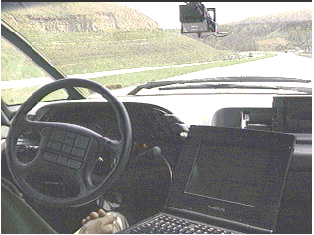
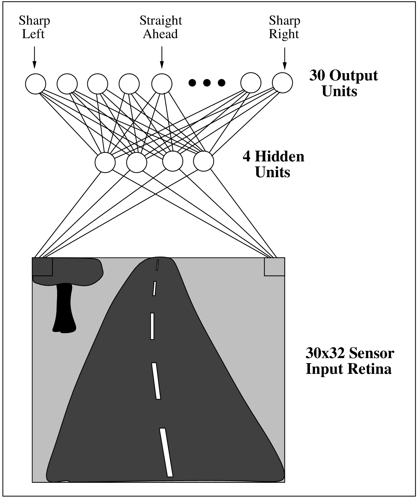
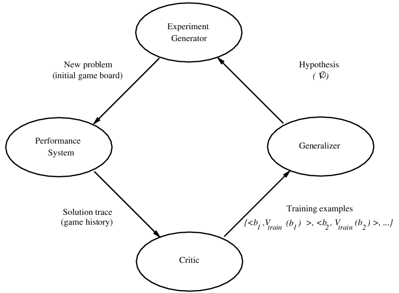
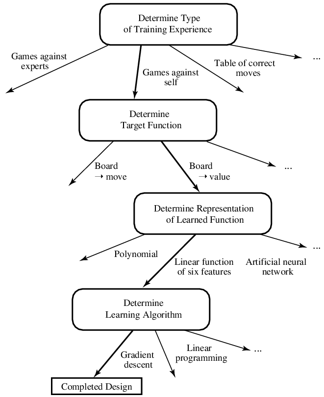

---
jupyter:
  jupytext:
    formats: ipynb,md
    text_representation:
      extension: .md
      format_name: markdown
      format_version: '1.3'
      jupytext_version: 1.13.0
  kernelspec:
    display_name: Python 3
    language: python
    name: python3
---

<!-- #region slideshow={"slide_type": "slide"} -->
# 课程简介
<!-- #endregion -->

<!-- #region slideshow={"slide_type": "subslide"} -->
## 机器学习

- 定义

    对于某类任务 $T$ 和性能度量 $P$
    如果一个计算机程序在T上以P衡量的性能随着经验E而自我完善，那么我们称这个计算机程序在从经验E学习。

<!-- #endregion -->

<!-- #region slideshow={"slide_type": "subslide"} -->
## 课程主要内容

-   概念学习
-   决策树学习
-   人工神经网络
-   评估假设
-   贝叶斯学习
-   计算学习理论
-   基于实例的学习
-   遗传算法
-   增强学习

<!-- #endregion -->
<!-- #region slideshow={"slide_type": "subslide"} -->
## 与其它课程关系

-   概率与数理统计
-   人工智能
-   模式识别
-   数据挖掘
-   最优化理论与方法
-   控制理论
-   生物学
-   心理学
-   哲学

<!-- #endregion -->
<!-- #region slideshow={"slide_type": "slide"} -->
# 机器学习示例

<!-- #endregion -->
<!-- #region slideshow={"slide_type": "subslide"} -->
## 机器学习示例

-   无人驾驶汽车
-   手写识别
-   人脸识别
-   垃圾邮件过滤

<!-- #endregion -->
<!-- #region slideshow={"slide_type": "subslide"} -->
## Typical Datamining Task


-   Given:
    -   9714 patient records, each describing a pregnancy and birth
    -   Each patient record contains 215 features
-   Learn to predict:
    -   item Classes of future patients at high risk for Emergency
        Cesarean Section

<!-- #endregion -->
<!-- #region slideshow={"slide_type": "subslide"} -->
## Datamining Result

-   Data:


-   One of 18 learned rules:

    ``` example
    If   No previous vaginal delivery, and
         Abnormal 2nd Trimester Ultrasound, and
         Malpresentation at admission
    Then Probability of Emergency C-Section is 0.6

     Over training data: 26/41 = .63, 
     Over test data: 12/20 = .60
    ```

<!-- #endregion -->
<!-- #region slideshow={"slide_type": "subslide"} -->
## Credit Risk Analysis

Data:


Rules learned from synthesized data:

``` example
If   Other-Delinquent-Accounts > 2, and
     Number-Delinquent-Billing-Cycles > 1
Then Profitable-Customer? = No
     [Deny Credit Card application]

If   Other-Delinquent-Accounts = 0, and
     (Income > $30k)  OR  (Years-of-Credit > 3)
Then Profitable-Customer? = Yes
     [Accept Credit Card application]
```

<!-- #endregion -->
<!-- #region slideshow={"slide_type": "subslide"} -->
## Customer purchase behavior:


<!-- #endregion -->
<!-- #region slideshow={"slide_type": "subslide"} -->
## Customer retention:


<!-- #endregion -->
<!-- #region slideshow={"slide_type": "subslide"} -->
## Process optimization:


<!-- #endregion -->
<!-- #region slideshow={"slide_type": "subslide"} -->
## ALVINN \[Pomerleau\] drives 70 mph on highways



|  . |  . |
|----|----|
||
<!-- #endregion -->
<!-- #region slideshow={"slide_type": "subslide"} -->
## Software that Customizes to User

`\center`{=latex}


\\centerline{<http://www.wisewire.com>}

<!-- #endregion -->
<!-- #region slideshow={"slide_type": "slide"} -->
# 学习问题的标准描述

<!-- #endregion -->
<!-- #region slideshow={"slide_type": "subslide"} -->
## 定义

对于某类任务 $T$ 和性能度量 $P$ ，如果一个计算机程序在 $T$ 上以 $P$
衡量的性能随着经验 $E$ 而自我完善，那么我们称这个计算机程序在从经验 $E$
学习。

-   例如，
    对于学习下西洋跳棋的计算机程序，它可以通过和自己下棋获取经验，它担负的任务是参与西洋跳棋对弈，它的性能用它赢棋的能力来衡量。
-   通常，为了很好地定义一个学习问题，我们必须明确这样三个特征：
    -   任务的种类；
    -   衡量任务提高的标准；
    -   经验的来源。

<!-- #endregion -->
<!-- #region slideshow={"slide_type": "subslide"} -->
## 西洋跳棋学习问题：

-   任务T：下西洋跳棋
-   性能标准P：比赛中击败对手的百分比
-   训练经验E：和自己进行对弈

<!-- #endregion -->
<!-- #region slideshow={"slide_type": "subslide"} -->
## 手写识别学习问题

-   任务T：识别和分类图像中的手写文字
-   性能标准P：分类的正确率
-   训练经验E：已知分类的手写文字数据库

<!-- #endregion -->
<!-- #region slideshow={"slide_type": "subslide"} -->
## 机器人驾驶学习问题

-   任务T：通过视觉传感器在四车道高速公路上驾驶
-   性能标准P：平均无差错行驶里程（差错由人类的监督裁定）
-   训练经验E：注视人类驾驶时录制的一系列图像和驾驶指令

<!-- #endregion -->
<!-- #region slideshow={"slide_type": "slide"} -->
# 设计一个学习系统

<!-- #endregion -->
<!-- #region slideshow={"slide_type": "subslide"} -->
## 西洋跳棋学习问题：

-   任务T：下西洋跳棋
-   性能标准P：世界锦标赛上击败对手的百分比
-   训练经验E：和自己进行对弈

为了完成这个学习系统的设计，现在需要选择：

-   要学习的经验
-   要学习的知识的确切类型
-   对于这个目标知识的表示
-   一种学习机制

<!-- #endregion -->
<!-- #region slideshow={"slide_type": "subslide"} -->
## 选取训练经验的类型

-   直接或间接
    -   直接的（direct）训练样例，即各种棋盘状态和相应的正确走子中学习。
    -   间接（indirect）的信息，包含很多过去的对弈序列和最终结局。(关于较早走子的正确性必须从对弈最终的输赢来推断。)
-   有无施教者
    -   学习器可能依赖施教者选取棋盘状态，和提供每一次的正确移动。或者，学习器可能自己提出它认为特别困惑的棋局并向施教者询问正确的走子。
    -   或者，学习器可以完全控制棋局和（间接的）训练分类，就像没有施教者时它和自己对弈进行学习一样。
-   训练样例的分布是否代表实例分布

<!-- #endregion -->
<!-- #region slideshow={"slide_type": "subslide"} -->
## 选择目标函数

-   目标函数1,
    对任何给定的棋局(合法棋局集合中的棋盘状态)能选出最好的走法(从合法走子集合中产生某个走子作为输出)
    $$ChooseMove: Board \rightarrow Move$$
-   目标函数2(评估函数),它为任何给定棋局赋予一个数字的评分
    $$V: Board \rightarrow \Re$$

<!-- #endregion -->
<!-- #region slideshow={"slide_type": "subslide"} -->
## 定义目标函数（ $V$ ）

-   例：
    -   如果b是一最终的胜局，那么V(b)=100
    -   如果b是一最终的负局，那么V(b)=-100
    -   如果b是一最终的和局，那么V(b)=0
    -   如果b不是最终棋局，那么V(b)=V(b\')，其中b\'是从b开始双方都采取最优对弈后可达到的终局。
-   注：正确，但不可操作

<!-- #endregion -->
<!-- #region slideshow={"slide_type": "subslide"} -->
## 选择目标函数表示

-   一组规则
-   神经网络
-   棋盘状态的多项式函数
-   ...

<!-- #endregion -->
<!-- #region slideshow={"slide_type": "subslide"} -->
## 目标函数表示

$$ w_{0} + w_{1}\cdot bp(b) + w_{2}\cdot rp(b) + w_{3}\cdot bk(b) + w_{4}\cdot rk(b) + w_{5}\cdot bt(b) + w_{6}\cdot rt(b) $$

-   $bp(b)$: number of black pieces on board $b$
-   $rp(b)$: number of red pieces on $b$
-   $bk(b)$: number of black kings on $b$
-   $rk(b)$: number of red kings on $b$
-   $bt(b)$: number of red pieces threatened by black (i.e., which can
    be taken on black\'s next turn)
-   $rt(b)$: number of black pieces threatened by red

<!-- #endregion -->
<!-- #region slideshow={"slide_type": "subslide"} -->
## 估计训练值

-   $V(b)$: 真实目标函数

-   $\hat{V}(b)$ : 学习到的函数

-   $V_{train}(b)$: 训练值

-   学习器可以得到的训练信息仅是对弈最后的胜负。

-   训练值估计法则 $$V_{train}(b) \leftarrow \hat{V}(Successor(b))$$
    $Successor(b)$ 表示 一个回合后的棋盘状态。

<!-- #endregion -->
<!-- #region slideshow={"slide_type": "subslide"} -->
## 权值调整

LMS 权值更新法则(LMS Weight update rule)

-   Do repeatedly:
    -   随机选取一个训练样例 $b$
    -   使用当前的权值计算 $error(b)$:
        $$error(b) = V_{train}(b) - \hat{V}(b)$$
    -   对每一个权值wi进行如下更新
        $$w_{i} \leftarrow w_{i} + c \cdot f_{i} \cdot error(b) $$ $c$
        是一个小常数, 如 0.1, 用来调整权值更新的幅度

<!-- #endregion -->
<!-- #region slideshow={"slide_type": "subslide"} -->
## 最终设计




<!-- #endregion -->
<!-- #region slideshow={"slide_type": "subslide"} -->
## 最终设计

-   执行系统（Performance
    system），这个模块是用学会的目标函数来解决给定的任务，在此就是对弈西洋跳棋。
    
它把新问题（新一盘棋）的实例作为输入，产生一组解答路线（对弈历史记录）作为输出。在这里，执行系统采用的选择下一步走法的策略是由学到的评估函数来决定的。所以我们期待它的性能会随着评估函数的日益准确而提高。
-   鉴定器（Critic），它以对弈的路线或历史记录作为输入，输出目标函数的一系列训练样例。

如图所示，每一个训练样例对应路线中的某个棋盘状态和目标函数给这个样例的评估值
$V_{train}$ 。

-   泛化器（Generalizer），它以训练样例作为输入，输出一个假设，作为它对目标函数的估计。

它从特定的训练样例中泛化，猜测一个一般函数，使其能够覆盖这些样例以及样例之外的情形。

-   实验生成器（Experiment
    Generator），它以当前的假设（当前学到的函数）作为输入，输出一个新的问题（例如，最初的棋局）供执行系统去探索。

它的角色是挑选新的练习问题，以使整个系统的学习速率最大化。

<!-- #endregion -->
<!-- #region slideshow={"slide_type": "subslide"} -->
## 设计过程




<!-- #endregion -->
<!-- #region slideshow={"slide_type": "slide"} -->
# 机器学习的问题

-   从特定的训练数据学习一般的目标函数存在什么样的算法？
    -   如果提供了充足的训练数据，什么样的条件下会使特定的算法收敛到期望的函数？
    -   哪个算法对哪些问题和表示的性能最好。
-   多少训练数据是充足的？
    -   怎样找到学习到的假设的置信度与训练数据的数量及提供给学习器的假设空间特性之间的一般关系？
-   学习器拥有的先验知识是怎样引导从样例进行泛化的过程的？
    -   当先验知识仅仅是近似正确时，它们会有帮助吗？
-   对于选择有用的后续训练经验，什么样的策略最好？
    -   这个策略的选择会怎样影响学习问题的复杂性？
-   怎样把学习任务简化为一个或多个函数逼近问题？
    -   换一种方式，系统该试图学习哪些函数？
    -   这个过程本身能自动化吗？
-   学习器怎样自动地改变表示法来提高表示和学习目标函数的能力？

<!-- #endregion -->
<!-- #region slideshow={"slide_type": "slide"} -->
# 机器学习相关资源

<!-- #endregion -->
<!-- #region slideshow={"slide_type": "subslide"} -->
## 课程

-   <https://www.coursera.org/learn/machine-learning> Machine Learning
    Stanford University (coursera)
-   <http://open.163.com/special/opencourse/machinelearning.html>
    斯坦福大学公开课 ：机器学习课程（网易公开课）
-   <http://open.163.com/special/opencourse/learningfromdata.html>
    加州理工学院公开课：机器学习与数据挖掘

<!-- #endregion -->
<!-- #region slideshow={"slide_type": "subslide"} -->
## 资料

-   <https://www.kaggle.com/> 数据科学竞赛平台、社区
-   <http://philschatz.com/biology-book/> a freedom book about biology
-   [[http://www.cs.cmu.edu/\\textasciitilde](http://www.cs.cmu.edu/\textasciitilde)
    tom/mlbook-chapter-slides.html](http://www.cs.cmu.edu/~tom/mlbook-chapter-slides.html)
    Machine Learning slide (LaTeX source )
-   <http://www.cs.cmu.edu/afs/cs.cmu.edu/project/theo-20/www/mlbook/latex-support.html>
    Machine Learning slide (LaTeX source )
-   <https://learnxinyminutes.com> \\ 各种程序设计语言快速入门
-   <http://cos.name/> 统计技术社区
-   <https://databricks.com/> Spark在线学习

<!-- #endregion -->
<!-- #region slideshow={"slide_type": "slide"} -->
# 工具

<!-- #endregion -->
<!-- #region slideshow={"slide_type": "subslide"} -->
## C/C++

-   <http://dlib.net>
-   <http://mlpack.org/>
-   <http://opencv.org/>
-   <http://caffe.berkeleyvision.org>
-   <http://mxnet.io/>

<!-- #endregion -->
<!-- #region slideshow={"slide_type": "subslide"} -->
## Lua

-   <http://torch.ch>
-   <https://github.com/torchnet/>

<!-- #endregion -->
<!-- #region slideshow={"slide_type": "subslide"} -->
## Python

-   <https://pytorch.org>
-   <http://scikit-learn.org/>
-   <https://www.tensorflow.org>
-   <http://www.deeplearning.net/software/theano/>
-   <https://github.com/NervanaSystems/neon>

<!-- #endregion -->
<!-- #region slideshow={"slide_type": "subslide"} -->
## Java

-   <http://www.cs.waikato.ac.nz/ml/weka/index.html>
-   <http://moa.cms.waikato.ac.nz/>
-   <http://spark.apache.org/mllib/>
-   <https://mahout.apache.org/>
-   <http://www.h2o.ai/>
-   <http://deeplearning4j.org/>
-   <http://neuroph.sourceforge.net/>
-   <http://airbnb.io/aerosolve/>

<!-- #endregion -->
<!-- #region slideshow={"slide_type": "subslide"} -->
## 科学计算

-   Rstudio(R)
-   Matlab/Octave
-   Scilab
-   Sage
-   Julia
-   Spyder(Python)
-   RapidMiner <https://rapidminer.com/>

<!-- #endregion -->
