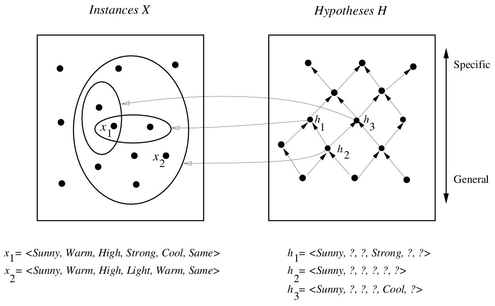
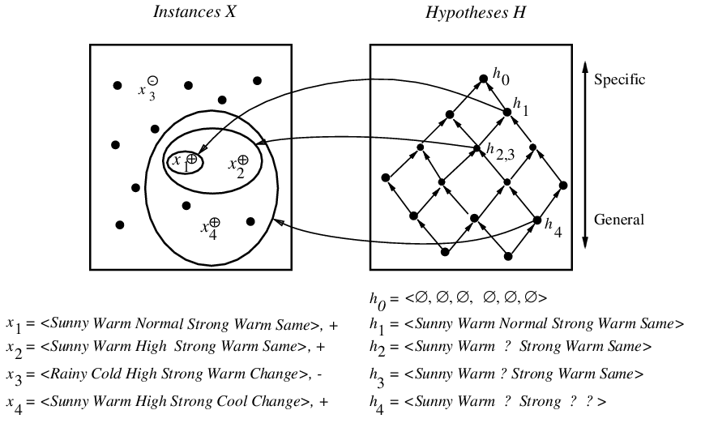
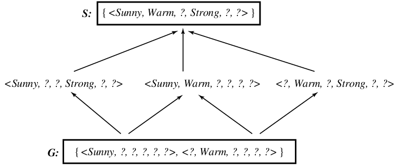
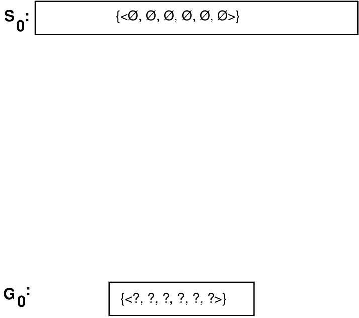
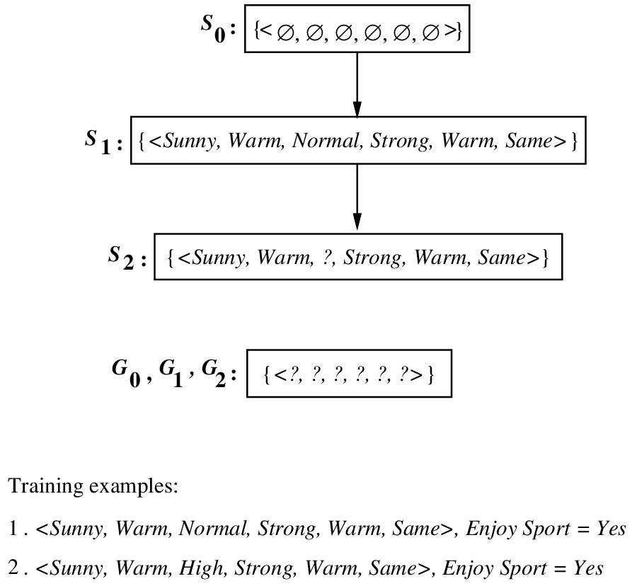
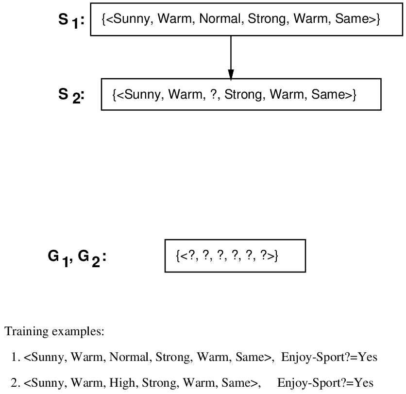
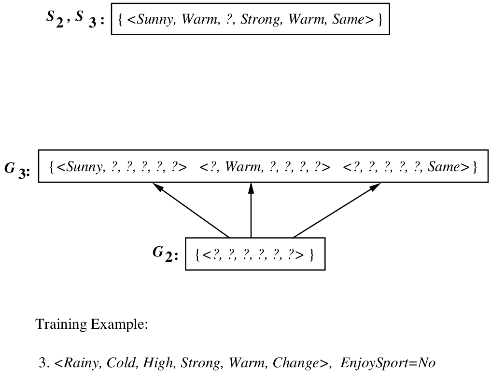
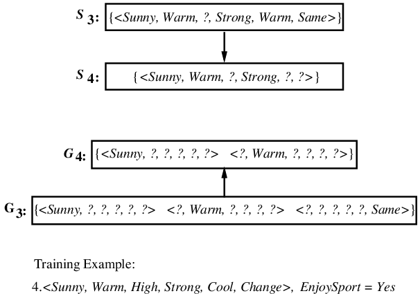
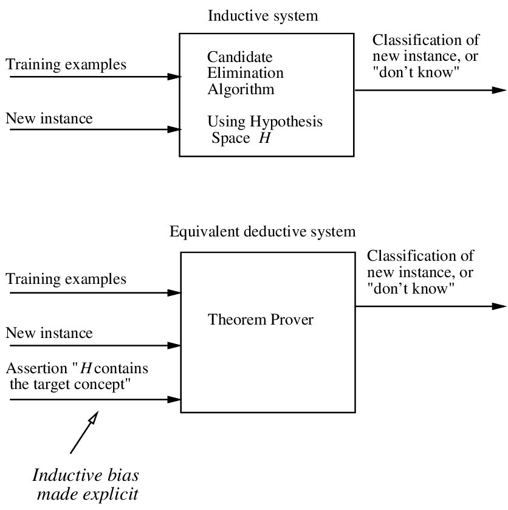

---
jupyter:
  jupytext:
    formats: ipynb,md
    text_representation:
      extension: .md
      format_name: markdown
      format_version: '1.3'
      jupytext_version: 1.13.0
  kernelspec:
    display_name: Python 3
    language: python
    name: python3
---

<!-- #region slideshow={"slide_type": "slide"} -->
# 概念学习
<!-- #endregion -->
<!-- #region slideshow={"slide_type": "subslide"} -->

## 什么是概念学习

<!-- #endregion -->
<!-- #region slideshow={"slide_type": "subslide"} -->
### 定义 

概念学习是指从有关某个布尔函数的输入输出训练样例中，推断出该布尔函数。

<!-- #endregion -->
<!-- #region slideshow={"slide_type": "subslide"} -->
## 示例

```
  Sky     AirTemp   Humid    Wind     Water   Forecst   EnjoySpt
  ------- --------- -------- -------- ------- --------- ----------
  Sunny   Warm      Normal   Strong   Warm    Same      Yes
  Sunny   Warm      High     Strong   Warm    Same      Yes
  Rainy   Cold      High     Strong   Warm    Change    No
  Sunny   Warm      High     Strong   Cool    Change    Yes
```
<!-- #endregion -->
<!-- #region slideshow={"slide_type": "subslide"} -->
## 假设

-   考虑各属性约束的合取式 $h$

-   每个属性可取值为：

    -   由"?"表示任意值
    -   明确指定的属性值（如 Water=Warm）
    -   由" $\emptyset$ "表示不接受任何值(如 Water=$\emptyset$ )

-   例如：
```
      Sky      AirTemp   Humid   Wind    Water   Forecst
      < Sunny   ?         ?      Strong   ?        Same  >
```
<!-- #endregion -->
<!-- #region slideshow={"slide_type": "subslide"} -->
## 任务

-   已知：
    -   实例集X：可能的日子，每个日子由下面的属性描述：
        -   Sky（可取值为Sunny，Cloudy和Rainy）
        -   AirTemp（可取值为Warm和Cold）
        -   Humidity（可取值为Normal和High）
        -   Wind（可取值为Strong和Weak）
        -   Water（可取值为Warm和Cool）
        -   Forecast（可取值为Same和Change）
    -   假设集H：每个假设描述为6个属性Sky，AirTemp，Humidity，Wind，Water和Forecast的值约束的合取。约束可以为"?"（表示接受任意值），"
        $\emptyset$ "（表示拒绝所有值），或一特定值。
    -   目标概念c: EnjoySport: $X\rightarrow \{0, 1\}$
    -   训练样例集D：目标函数的正例和反例
        $\langle x_1, c(x_1) \rangle , \ldots \langle x_m, c(x_m) \rangle$
-   求解：
    -   $H$ 中的一假设 $h$ ，使对于 $X$ 中任意 $x$ ， $h(x)=c(x)$ 。

<!-- #endregion -->
<!-- #region slideshow={"slide_type": "subslide"} -->
##  归纳学习假设

任一假设如果在足够大的训练样例集中很好地逼近目标函数，它也能在未见实例中很好地逼近目标函数。
<!-- #endregion -->
<!-- #region slideshow={"slide_type": "subslide"} -->
## more-general-than-or-equal-to



<!-- #endregion -->
<!-- #region slideshow={"slide_type": "subslide"} -->
## more-general-than-or-equal-to

定义： 令 $h_j$ 和 $h_k$ 为在 $X$ 上定义的布尔函数。定义一个
more-general-than-or-equal-to 关系，记做 $\geq_g$ 。 称 $h_j \geq_g h_k$
当且仅当

$$(\forall x\in X)[(h_k(x)=1)\rightarrow (h_j(x)=1)]$$

<!-- #endregion -->
<!-- #region slideshow={"slide_type": "slide"} -->
# FIND-S

<!-- #endregion -->
<!-- #region slideshow={"slide_type": "subslide"} -->
## FIND-S 算法

-   将 $h$ 初始化为 $H$ 中最特殊假设
-   对每个正例 $x$
    -   对h的每个属性约束 $a_i$
        -   如果 $x$ 满足 $a_i$ 那么 不做任何事
        -   否则将 $h$ 中 $a_i$ 替换为满足 $x$ 的紧邻的更一般约束
-   输出假设h

<!-- #endregion -->
<!-- #region slideshow={"slide_type": "subslide"} -->
## FIND-S 的假设空间搜索




<!-- #endregion -->
<!-- #region slideshow={"slide_type": "slide"} -->
# 变型空间和候选消除算法

<!-- #endregion -->
<!-- #region slideshow={"slide_type": "subslide"} -->
## 表示

-   一致(Consistent)：
    一个假设h与训练样例集合D一致(consistent)，当且仅当对
    $\langle x, c(x) \rangle$ in $D$ 都有 h(x)=c(x)。

$$Consistent(h,D) \equiv (\forall \langle x, c(x) \rangle \in D)\  h(x)=c(x) $$

-   变型空间(version space)： 关于假设空间 $H$ 和训练样例集 $D$
    的变型空间(version space)，标记为 $VS_{H,D}$ ，是 $H$ 中与训练样例
    $D$ 一致的所有假设构成的子集。

$$VS_{H,D} \equiv \{h \in H|Consistent(h,D)\} $$

<!-- #endregion -->
<!-- #region slideshow={"slide_type": "subslide"} -->
## 列表后消除算法(List-Then-Eliminate)

-   变型空间 $VersionSpace\leftarrow$ 包含H中所有假设的列表
-   对每个训练样例 $\langle x, c(x)\rangle$
    -   从变型空间中移除所有 $h(x)\neq c(x)$ 的假设h
-   输出 $VersionSpace$ 中的假设列表

<!-- #endregion -->
<!-- #region slideshow={"slide_type": "subslide"} -->
## 变型空间的更简洁表示

-   定义： 关于假设空间H和训练数据D的一般边界（General
    boundary）G，是在H中与D相一致的极大一般（maximally
    general）成员的集合。
    $S\equiv\{ g\in H | Consistent(g, D)\land(\neg\exists g'\in H)[(g' >_g g)\land Consistent(g', D)]\}$
-   定义： 关于假设空间H和训练数据D的特殊边界（Specific
    boundary）S，是在H中与D相一致的极大特殊（maximally
    specific）成员的集合。
    $S\equiv\{ s\in H | Consistent(s, D)\land(\neg\exists s'\in H)[(s >_g s')\land Consistent(s', D)]\}$

<!-- #endregion -->
<!-- #region slideshow={"slide_type": "subslide"} -->
## 例




<!-- #endregion -->
<!-- #region slideshow={"slide_type": "subslide"} -->
## 变型空间表示定理

令 $X$ 为一任意的实例集合， $H$ 与为 $X$ 上定义的布尔假设的集合。令
$c: X\rightarrow\{0, 1\}$ 为 $X$ 上定义的任一目标概念，并令 $D$
为任一训练样例的集合 $\{\langle x, c(x)\rangle\}$ 。对所有的 $X,H,c,D$
以及良好定义的 $S$ 和 $G$ ：
$$VS_{H,D} = \{ h\in H | (\exists s\in S) (\exists g\in G) (g\geq_g h \geq_g s)\}$$

<!-- #endregion -->
<!-- #region slideshow={"slide_type": "subslide"} -->
## 候选消除算法(Candidate Elimination Algorithm)

-   将G集合初始化为H中极大一般假设
-   将S集合初始化为H中极大特殊假设
-   对每个训练样例d，进行以下操作：
-   如果d是一正例
    -   从G中移去所有与d不一致的假设
    -   对S中每个与d不一致的假设s
        -   从S中移去s

        -   把s的所有的极小泛化式h加入到S中，其中h满足:

            h与d一致，而且G的某个成员比h更一般

        -   从S中移去所有这样的假设：它比S中另一假设更一般
-   如果d是一个反例
    -   从S中移去所有与d不一致的假设
    -   对G中每个与d不一致的假设g
        -   从G中移去g

        -   把g的所有的极小特殊化式h加入到G中，其中h满足:

            h与d一致，而且S的某个成员比h更特殊
    -   从G中移去所有这样的假设：它比G中另一假设更特殊

<!-- #endregion -->
<!-- #region slideshow={"slide_type": "subslide"} -->
## 算法示例




<!-- #endregion -->
<!-- #region slideshow={"slide_type": "subslide"} -->
## 算法示例




<!-- #endregion -->
<!-- #region slideshow={"slide_type": "subslide"} -->
## 算法示例




<!-- #endregion -->
<!-- #region slideshow={"slide_type": "subslide"} -->
## 算法示例




<!-- #endregion -->
<!-- #region slideshow={"slide_type": "subslide"} -->
## 算法示例




<!-- #endregion -->
<!-- #region slideshow={"slide_type": "subslide"} -->
## 算法示例


<!-- #endregion -->
<!-- #region slideshow={"slide_type": "subslide"} -->
# 归纳偏置

<!-- #endregion -->
<!-- #region slideshow={"slide_type": "subslide"} -->
## 一个有偏的假设空间

EnjoySportw例子中，假设空间限制为只包含属性值的合取。不能够表示最简单的析取形式的目标概念，如"Sky=Sunny
or Sky=Cloudy"。
给定以下三个训练样例，它们来自于该析取式假设，我们的算法将得到一个空的变型空间。

``` 
  Sky      AirTemp   Humidity   Wind     Water   Forecast   EnjoySport
  -------- --------- ---------- -------- ------- ---------- ------------
  Sunny    Warm      Normal     Strong   Cool    Change     Yes
  Cloudy   Warm      Normal     Strong   Cool    Change     Yes
  Rainy    Warm      Normal     Strong   Cool    Change     No
```

<!-- #endregion -->
<!-- #region slideshow={"slide_type": "subslide"} -->
## 无法生成变型空间的原因

与头两个样例一致，并且能在给定假设空间H中表示的最特殊的假设是：

```
S2: <?, Warm, Nornal, Strong, Cool, Change>
```

将第三个样例错误地划为正例。

<!-- #endregion -->
<!-- #region slideshow={"slide_type": "subslide"} -->
## 无偏的学习器

为EnjoySport学习任务定义一个新的假设空间H\'，允许使用前面的假设的任意析取、合取和否定式。例如目标概念"Sky=Sunny
or Sky=Cloudy"可被描述为：

\<Sunny, ?, ?, ?, ?, ?> ∨ \<Cloudy, ?, ?, ?, ?, ?>

排除了表达能力的问题，但概念学习算法将完全无法从训练样例中泛化！

<!-- #endregion -->
<!-- #region slideshow={"slide_type": "subslide"} -->
## 无法泛化的原因

如下，假定我们提供了3个正例（x1，x2，x3）以及两个反例（x4，x5）给学习器。这时，变型空间的S边界包含的假设正好是三个正例的析取：

$$S: \{ (x_1 \lor x_2 \lor x_3) \}$$

因为这是能覆盖3个正例的最特殊假设。相似地，G边界将由那些刚好能排除掉反例的那些假设组成。
$G: \{\neg (x_4\lor x_5)\}$

<!-- #endregion -->
<!-- #region slideshow={"slide_type": "subslide"} -->
## 归纳编置

定义：考虑对于实例集合X的概念学习算法 $L$ ， 令

-   $c$ 为 $X$ 上定义的任一概念,
-   $D_c = \{\langle x, c(x) \rangle \}$ 为 $c$ 的任意训练样例集合。
-   $L(x_i,D_c)$ 表示经过数据 $D_c$ 的训练后 $L$ 赋予实例 $x_i$ 的分类。

$L$ 的归纳偏置是最小断言集合 $B$ ，它使任意目标概念 $c$ 和相应的训练样例
$D_c$ 满足

$$
(\forall x_i \in X) [(B \land D_c \land x_i) \vdash L(x_i,D_c)]
$$

$A \vdash B$ 表示 $A$ 逻辑蕴涵 $B$

<!-- #endregion -->
<!-- #region slideshow={"slide_type": "subslide"} -->
## 归纳系统与等价的演绎系统




<!-- #endregion -->
<!-- #region slideshow={"slide_type": "subslide"} -->
## 归纳偏置不同的学习器

-   机械学习器（Rote-Learner）
    -   简单地将每个观察到的训练样例存储下来。
    -   后续的实例的分类通过在内存中匹配进行。
        -   如果实例在内存中找到了，存储的分类结果被输出。
        -   否则系统拒绝进行分类。
-   候选消除算法
    -   新的实例只在变型空间所有成员都进行同样分类时才输出分类结果
    -   否则系统拒绝分类。
-   Find-S
    -   算法寻找与训练样例一致的最特殊的假设
    -   用这一假设来分类后续实例。
<!-- #endregion -->
