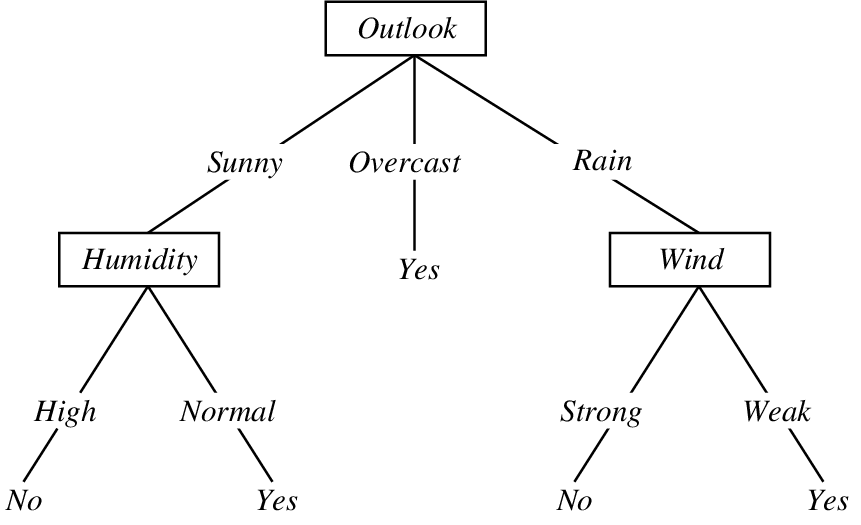
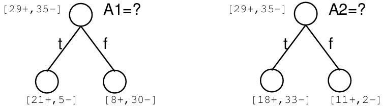
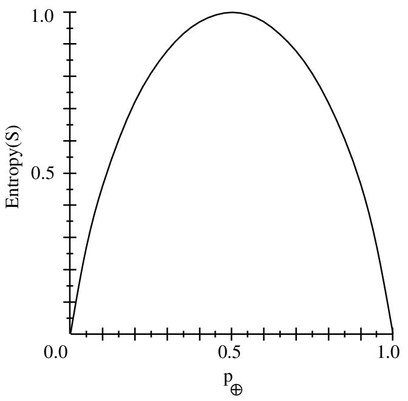
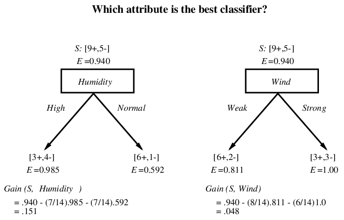
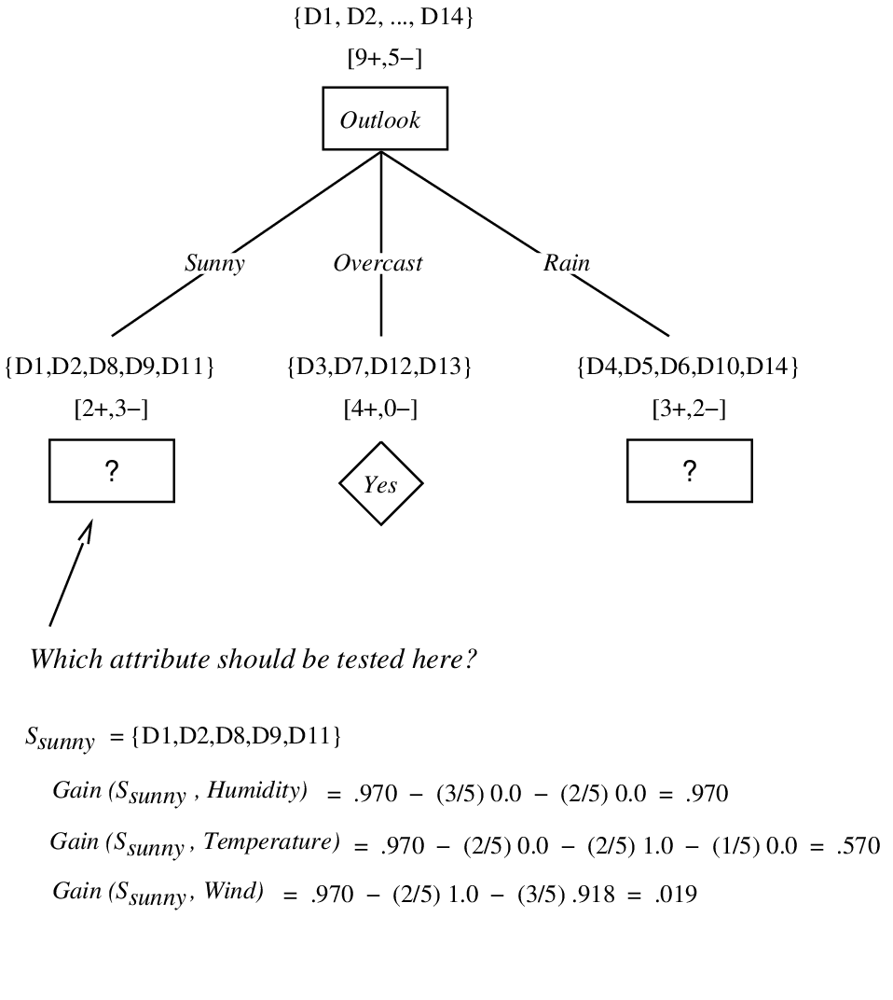
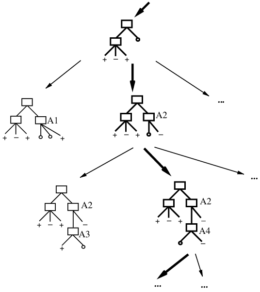
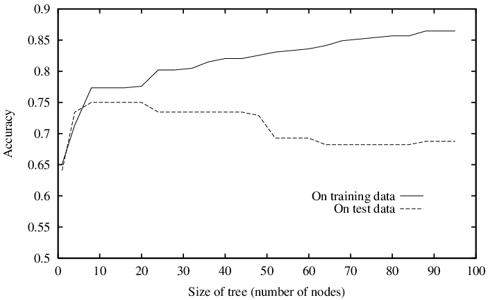
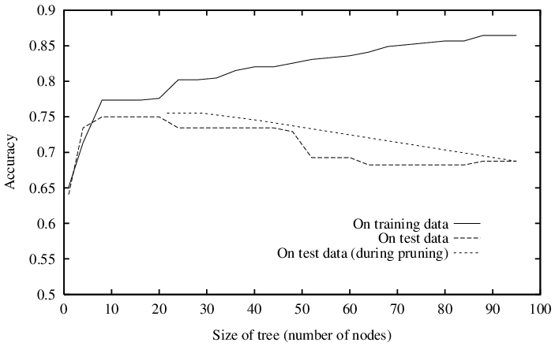

---
jupyter:
  jupytext:
    formats: ipynb,md
    text_representation:
      extension: .md
      format_name: markdown
      format_version: '1.3'
      jupytext_version: 1.13.1
  kernelspec:
    display_name: Python 3
    language: python
    name: python3
---

<!-- #region slideshow={"slide_type": "slide"} -->
# 决策树介绍
<!-- #endregion -->
<!-- #region slideshow={"slide_type": "subslide"} -->
## 决策树表示法

-   决策树通过把实例从根结点排列（sort）到某个叶子结点来分类实例，叶子结点即为实例所属的分类。
-   树上的每一个结点指定了对实例的某个属性（attribute）的测试，并且该结点的每一个后继分支对应于该属性的一个可能值。
-   分类实例的方法是从这棵树的根结点开始，测试这个结点指定的属性，然后按照给定实例的该属性值对应的树枝向下移动。
-   这个过程再在以新结点为根的子树上重复。

<!-- #endregion -->
<!-- #region slideshow={"slide_type": "subslide"} -->
## 决策树学习的适用问题

-   实例是由"属性---值"对（pair）表示的。
    -   实例是用一系列固定的属性（例如，Temperature）和它们的值（例如，Hot）来描述的。
    -   最简单的决策树学习中，每一个属性取少数的分离的值（例如，Hot、Mild、Cold）。
-   目标函数具有离散的输出值。
    -   决策树可给每个实例赋予一个布尔型的分类（例如，yes或no）。
    -   决策树方法很容易扩展到学习有两个以上输出值的函数。
    -   一种更强有力的扩展算法允许学习具有实数值输出的函数，尽管决策树在这种情况下的应用不太常见。

<!-- #endregion -->
<!-- #region slideshow={"slide_type": "subslide"} -->
## 决策树学习的适用问题

-   可能需要析取的描述（disjunctive description）。
-   训练数据可以包含错误。
    -   决策树学习对错误有很好的鲁棒性，无论是训练样例所属的分类错误还是描述这些样例的属性值错误。
-   训练数据可以包含缺少属性值的实例。

<!-- #endregion -->
<!-- #region slideshow={"slide_type": "subslide"} -->
## Decision Tree for $PlayTennis$



<!-- #endregion -->
<!-- #region slideshow={"slide_type": "subslide"} -->
## A Tree to Predict C-Section Risk

-   Learned from medical records of 1000 women
-   Negative examples are C-sections

``` example

[833+,167-] .83+ .17-
Fetal_Presentation = 1: [822+,116-] .88+ .12-
| Previous_Csection = 0: [767+,81-] .90+ .10-
| | Primiparous = 0: [399+,13-] .97+ .03-
| | Primiparous = 1: [368+,68-] .84+ .16-
| | | Fetal_Distress = 0: [334+,47-] .88+ .12-
| | | | Birth_Weight < 3349: [201+,10.6-] .95+ .05-
| | | | Birth_Weight >= 3349: [133+,36.4-] .78+ .22-
| | | Fetal_Distress = 1: [34+,21-] .62+ .38-
| Previous_Csection = 1: [55+,35-] .61+ .39-
Fetal_Presentation = 2: [3+,29-] .11+ .89-
Fetal_Presentation = 3: [8+,22-] .27+ .73-

```

<!-- #endregion -->
<!-- #region slideshow={"slide_type": "slide"} -->
# 基本的决策树学习算法

<!-- #endregion -->
<!-- #region slideshow={"slide_type": "subslide"} -->
## ID3(Examples，Target_Attribute，Attributes)

-   Examples: 训练样例集。
-   Target_Attribute: 要预测的目标属性。
-   Attributes: 除目标属性外供学习到的决策树测试的属性列表。
-   返回值：能分类给定Examples的决策树。

<!-- #endregion -->
<!-- #region slideshow={"slide_type": "subslide"} -->
## ID3(Examples，Target_Attribute，Attributes)

-   创建树的Root结点
-   若Examples都为正，返回 $label =+$ 的单结点树Root
-   若Examples都为反，返回 $label =-$ 的单结点树Root
-   如果Attributes为空，那么返回单结点树Root，label=Examples中最普遍的Target_Attribute值

<!-- #endregion -->
<!-- #region slideshow={"slide_type": "subslide"} -->
## ID3(Examples，Target_Attribute，Attributes)

-   否则:
    -   A←Attributes中分类Examples能力最好的属性
    -   Root的决策属性←A
    -   对于A的每个可能值 $v_i$
        -   在Root下加一个新的分支对应测试 $A=v_i$
        -   令 $Examples_{v_i}$ 为Examples中满足A属性值为 $v_i$ 的子集
        -   $Examples_{v_i}$ 是否为空？
            -   是则在这个新分支下加一个叶子结点，结点的label=Examples中最普遍的Target_Attribute值

            -   否则在这个新分支下加一个子树:

                ID3( $Examples_{v_i}$ ,Target_Attribute,Attributes-{A})

<!-- #endregion -->
<!-- #region slideshow={"slide_type": "subslide"} -->
## 最佳分类属性



<!-- #endregion -->
<!-- #region slideshow={"slide_type": "subslide"} -->
## 熵（entropy）

-   给定包含关于某个目标概念的正反样例的样例集S，那么S相对这个布尔型分类的熵为：

    $$ Entropy(S) \equiv  - p_{\oplus} \log_{2} p_{\oplus} -  p_{\ominus} \log_{2}p_{\ominus} $$

    -   $p_{\oplus}$ 是 $S$ 中正例的比例
    -   $p_{\ominus}$ 是 $S$ 中反例的比例

-   熵确定了要编码集合 S
    中任意成员（即以均匀的概率随机抽出的一个成员）的分类所需要的最少二进制位数。

<!-- #endregion -->
<!-- #region slideshow={"slide_type": "subslide"} -->
## 熵（entropy）




<!-- #endregion -->
<!-- #region slideshow={"slide_type": "subslide"} -->
## 信息增益度量

-   一个属性的信息增益就是由于使用这个属性分割样例而导致的期望熵降低。

-   一个属性A相对样例集合S的信息增益Gain(S,A)定义为:

    $$ Gain(S,A) \equiv Entropy(S)\ - \sum_{v \in Values(A)} \frac{|S_{v}|}{|S|}Entropy(S_{v}) $$

    其中

    -   Values(A)是属性A所有可能值的集合，
    -   $S_v$ 是S中属性A的值为v的子集（即： $S_v=\{s\in S|A(s)=v\}$ ）

<!-- #endregion -->
<!-- #region slideshow={"slide_type": "subslide"} -->
## 信息增益度量


<!-- #endregion -->
<!-- #region slideshow={"slide_type": "subslide"} -->
## 例
```
   Day   Outlook    Temperature   Humidity   Wind     PlayTennis
  ----- ---------- ------------- ---------- -------- ------------
  D1    Sunny      Hot           High       Weak     No
  D2    Sunny      Hot           High       Strong   No
  D3    Overcast   Hot           High       Weak     Yes
  D4    Rain       Mild          High       Weak     Yes
  D5    Rain       Cool          Normal     Weak     Yes
  D6    Rain       Cool          Normal     Strong   No
  D7    Overcast   Cool          Normal     Strong   Yes
  D8    Sunny      Mild          High       Weak     No
  D9    Sunny      Cool          Normal     Weak     Yes
  D10   Rain       Mild          Normal     Weak     Yes
  D11   Sunny      Mild          Normal     Strong   Yes
  D12   Overcast   Mild          High       Strong   Yes
  D13   Overcast   Hot           Normal     Weak     Yes
  D14   Rain       Mild          High       Strong   No
```
<!-- #endregion -->
<!-- #region slideshow={"slide_type": "subslide"} -->
## Selecting the Next Attribute



<!-- #endregion -->
<!-- #region slideshow={"slide_type": "subslide"} -->
## Selecting the Next Attribute




<!-- #endregion -->
<!-- #region slideshow={"slide_type": "subslide"} -->
## Hypothesis Space Search by ID3




<!-- #endregion -->
<!-- #region slideshow={"slide_type": "slide"} -->
# ID3算法的搜索空间和搜索策略

<!-- #endregion -->
<!-- #region slideshow={"slide_type": "subslide"} -->
## ID3算法的搜索空间

-   ID3算法中的假设空间包含所有的决策树，它是相对于现有属性的有限离散值函数的一个完整空间。
    -   因为每个有限离散值函数可被表示为某个决策树，所以ID3算法避免了搜索不完整假设空间（例如那些仅考虑合取假设的方法）的一个主要风险：

        假设空间可能不包含目标函数。
-   当遍历决策树空间时，ID3仅维护单一的当前假设。
    -   这与变型空间候选消除方法不同，后者维护了与当前的训练样例一致的所有假设的集合。
    -   因为仅考虑单一的假设，ID3算法失去了表示所有一致假设所带来的优势。
    -   例如，它不能判断有多少个其他的决策树也是与现有的训练数据一致的，或者使用新的实例查询来最优地区分这些竞争假设。

<!-- #endregion -->
<!-- #region slideshow={"slide_type": "subslide"} -->
## ID3算法的搜索策略

-   基本的ID3算法在搜索中不进行回溯。每当在树的某一层次选择了一个属性进行测试，它不会再回溯重新考虑这个选择。
    -   所以，它易受无回溯的爬山搜索中常见风险影响：收敛到局部最优的答案，但不是全局最优的。
    -   对于ID3算法，一个局部最优的答案对应着它在一条搜索路径上探索时选择的决策树。然而，这个局部最优的答案可能不如沿着另一条分支搜索到的更令人满意。

<!-- #endregion -->
<!-- #region slideshow={"slide_type": "subslide"} -->
## ID3算法的搜索策略

-   ID3算法在搜索的每一步都使用当前的所有训练样例，以统计为基础决定怎样精化当前的假设。
    -   这与那些基于单独的训练样例递增作出决定的方法（例如， Find-S
        或候选消除法）不同。
    -   使用所有样例的统计属性（例如，信息增益）的一个优点是大大减小了对个别训练样例错误的敏感性。
    -   因此，通过修改ID3算法的终止准则以接受不完全拟合训练数据的假设，它可以被很容易地扩展到处理含有噪声的训练数据。

<!-- #endregion -->
<!-- #region slideshow={"slide_type": "slide"} -->
# ID3算法归纳偏置

<!-- #endregion -->
<!-- #region slideshow={"slide_type": "subslide"} -->
## BFS-ID3(Breadth First Search)

-   从一个空的树开始广度优先（breadth first）搜索逐渐复杂的树，
-   先考虑所有深度为1的树，然后所有深度为2的，......。
-   一旦它找到了一个与训练数据一致的决策树，它返回搜索深度的最小的一致树（例如，具有最少结点的树）。
-   BFS-ID3寻找最短的决策树，因此精确地具有"较短的树比较长的得到优先"的偏置。

<!-- #endregion -->
<!-- #region slideshow={"slide_type": "subslide"} -->
## ID3归纳偏置：

-   ID3可被看作BFS-ID3的一个有效近似，它使用一种贪婪的启发式搜索企图发现最短的树，而不用进行完整的广度优先搜索来遍历假设空间。
-   较短的树比较长的得到优先。
-   信息增益高的属性更靠近根结点的树得到优先。

<!-- #endregion -->
<!-- #region slideshow={"slide_type": "subslide"} -->
## ID3算法和候选消除算法的归纳偏置不同

-   ID3的搜索范围是一个完整的假设空间（例如，能表示任何有限的离散值函数的空间）。
-   但它不彻底地搜索这个空间，从简单的假设到复杂的假设，直到遇到终止条件（例如，它发现了一个与数据一致的假设）。
-   它的归纳偏置完全是搜索策略排序假设的结果。它的假设空间没有引入额外的偏置。
-   变型空间候选消除算法的搜索范围是不完整的假设空间（即一个仅能表示潜在可教授概念子集的空间）。
-   但它彻底地搜索这个空间，查找所有与训练数据一致的假设。
-   它的归纳偏置完全是假设表示的表达能力的结果。它的搜索策略没有引入额外的偏置。

<!-- #endregion -->
<!-- #region slideshow={"slide_type": "subslide"} -->
## 限定偏置和优选偏置

-   ID3的归纳偏置来自它的搜索策略，
-   而候选消除算法的归纳偏置来自它对搜索空间的定义。
-   ID3的归纳偏置是对某种假设（例如，对于较短的假设）胜过其他假设的一种优选（preference），它对最终可列举的假设没有硬性限制。
    这种类型的偏置通常被称为优选偏置（preference
    bias）（或叫搜索偏置（search bias））。
-   候选消除算法的偏置是对待考虑假设的一种限定（restriction）。
    这种形式的偏置通常被称为限定偏置（或者叫语言偏置（language
    bias））。

<!-- #endregion -->
<!-- #region slideshow={"slide_type": "subslide"} -->
## 奥坎姆剃刀 (Occam\'s Razor)

优先选择拟合数据的最简单假设。

支持论点:

-   短假设的数量少于长假设（基于简单的参数组合）
-   $\rightarrow$ 一个短的假设与训练数据拟合的偶然性较小
-   $\rightarrow$ 复杂的假设拟合当前的训练数据的偶然性较大

反对论点:

-   可以定义很多小的假设集合------其中的大多数相当晦涩难解。根据什么相信有短描述（short
    description）的决策树组成的小假设集合就比其他众多可定义的小假设集合更适当呢？
-   假设的大小是由学习者内部使用的特定表示决定的。所以两个学习器使用不同的内部表示会得到不同的假设

<!-- #endregion -->
<!-- #region slideshow={"slide_type": "slide"} -->
# 决策树学习的常见问题

<!-- #endregion -->
<!-- #region slideshow={"slide_type": "subslide"} -->
## 过拟合（Overfitting）数据

Consider adding noisy training example #15:

$$ Sunny,\  Hot,\  Normal,\  Strong,\ PlayTennis=No $$

What effect on earlier tree?


<!-- #endregion -->
<!-- #region slideshow={"slide_type": "subslide"} -->
## 过拟合（Overfitting）数据

考虑假设 $h$ 错误率

-   训练数据: $error_{train}(h)$
-   数据的整个分布 $\cal{D}$ : $error_{\cal{D}}(h)$

定义： 给定一个假设空间 $H$ ，一个假设 $h\in H$ ，如果存在其他的假设
$h'\in H$ ，使得在训练样例上h的错误率比 $h'$ 小，
$$  error_{train}(h) < error_{train}(h') $$ 但在整个实例分布上 $h'$
的错误率比h小， $$  error_{\cal{D}}(h) > error_{\cal{D}}(h') $$
那么就说假设 $h$ 过度拟合（overfit）训练数据。

<!-- #endregion -->
<!-- #region slideshow={"slide_type": "subslide"} -->
## Overfitting in Decision Tree Learning



<!-- #endregion -->
<!-- #region slideshow={"slide_type": "subslide"} -->
## 避免决策树学习中的过度拟合

-   及早停止增长树法，在ID3算法完美分类训练数据之前停止增长树；
-   后修剪法（post-prune），即允许树过度拟合数据，然后对这个树后修剪。

<!-- #endregion -->
<!-- #region slideshow={"slide_type": "subslide"} -->
## 确定最终正确树大小的准则

-   使用与训练样例截然不同的一套分离的样例，来评估通过后修剪方法从树上修剪结点的效用。（训练和验证集（training
    and validation set）法。）
-   使用所有可用数据进行训练，但进行统计测试来估计扩展（或修剪）一个特定的结点是否有可能改善在训练集合外的实例上的性能。
    -   例如，Quinlan
        （1986）使用一种卡方（chi-square）测试来估计进一步扩展结点是否能改善在整个实例分布上的性能，还是仅仅改善了在当前的训练数据上的性能。
-   使用一个明确的标准来衡量训练样例和决策树编码的复杂度，当这个编码的长度最小时停止增长树。
    -   这个方法基于一种启发式规则，被称为最小描述长度（Minimum
        Description Length）的准则
    -   MDL: minimize $size(tree) + size(misclassifications(tree))$

<!-- #endregion -->
<!-- #region slideshow={"slide_type": "subslide"} -->
## 错误率降低修剪

将数据分为训练（ $training$ ） 与验证 （ $validation$ ） 集合。

这样便使因为训练集合的巧合规律性而加入的结点很可能被删除，因为同样的巧合不大会发生在验证集合中。反复地修剪结点，每次总是选取它的删除可以最大提高决策树在验证集合上的精度的结点。

-   考虑将树上的每一个结点作为修剪的候选对象。
    -   假设删除以此结点为根的子树，使它成为叶子结点，把和该结点关联的训练样例的最常见分类赋给它。
    -   评估修剪后的树对于验证集合的性能
-   采用贪心算法去除在最影响验证集上精度的结点
-   重复修剪结点直到进一步的修剪是有害的（降低了在验证集合上的精度）

<!-- #endregion -->
<!-- #region slideshow={"slide_type": "subslide"} -->
## 错误率降低修剪的效果



<!-- #endregion -->
<!-- #region slideshow={"slide_type": "subslide"} -->
## 规则后修剪（rule post-pruning）

规则后修剪包括下面的步骤：

-   从训练集合推导出决策树，增长决策树直到尽可能好地拟合训练数据，允许过度拟合发生。
-   将决策树转化为等价的规则集合，方法是为从根结点到叶子结点的每一条路径创建一条规则。
-   通过删除任何能导致估计精度提高的前件（preconditions）来修剪（泛化）每一条规则。
-   按照修剪过的规则的估计精度对它们进行排序；并按这样的顺序应用这些规则来分类后来的实例。

<!-- #endregion -->
<!-- #region slideshow={"slide_type": "subslide"} -->
## 决策树转化为等价的规则集合


  ------ -------------------------------------------
  IF     $(Outlook=Sunny) \land (Humidity=High)$
  THEN   $PlayTennis=No$
         
  IF     $(Outlook=Sunny) \land (Humidity=Normal)$
  THEN   $PlayTennis=Yes$
         
  ...    
  ------ -------------------------------------------

<!-- #endregion -->
<!-- #region slideshow={"slide_type": "subslide"} -->
## 决策树转化成规则集的好处：

-   转化为规则集可以区分决策结点使用的不同上下文。
    -   因为贯穿决策结点的每条不同路径产生一条不同的规则，所以对于不同路径，关于一个属性测试的修剪决策可以不同。
    -   如果直接修剪树本身，只有两个选择，要么完全删除决策结点，要么保留它的本来状态。
-   转化为规则集消除了根结点附近的属性测试和叶结点附近的属性测试的区别，避免了零乱的记录问题。
    -   比如若是根结点被修剪了但保留它下面的部分子树时如何重新组织这棵树。
-   转化为规则提高了可读性。对于人来说规则总是更容易理解的。

<!-- #endregion -->
<!-- #region slideshow={"slide_type": "subslide"} -->
## 连续值属性

动态地定义新的离散值属性，即先把连续值属性的值域分割为离散的区间集合。

-   $Temperature = 82.5$
-   $(Temperature>72.3) = t,f$
```
  ------------------ ---- ---- ----- ----- ----- ----
  {*Temperature*}:   40   48   60    72    80    90
  {*PlayTennis*}:    No   No   Yes   Yes   Yes   No
  ------------------ ---- ---- ----- ----- ----- ----
```
<!-- #endregion -->
<!-- #region slideshow={"slide_type": "subslide"} -->
## 属性选择的其它度量标准

多值的属性(Attributes with Many Values)

-   If attribute has many values, $Gain$ will select it
-   Imagine using $Date = Jun\_3\_1996$ as attribute

增益比率 ( $GainRatio$ )

$$GainRatio(S,A) \equiv \frac{Gain(S,A)}{SplitInformation(S,A)} $$

$$ SplitInformation(S,A) \equiv - \sum_{i=1}^{c} \frac{|S_{i}|}{|S|} \log_{2}\frac{|S_{i}|}{|S|} $$

其中 $S_{i}$ 是 $S$ 中属性 $A$ 的值为 $v_{i}$ 的子集

<!-- #endregion -->
<!-- #region slideshow={"slide_type": "subslide"} -->
## 缺少属性值的训练样例(Unknown Attribute Values)

What if some examples missing values of $A$?

-   赋给它结点 $n$ 的训练样例中该属性的最常见值。
-   赋给它结点 $n$ 的具有同样目标值的训练样例中该属性的最常见值。
-   为A的每个可能值赋与一个概率，按此比例将样例分配到子树中。
    -   例如，给定一个布尔属性A，如果结点n包含6个已知A=1和6个A=0的样例，那么A(x)=1的概率是0.6，A(x)=0的概率是0.4。
        实例x的 60\\% 被分配到 A=1 的分支，40\\% 被分配到另一个分支。

<!-- #endregion -->
<!-- #region slideshow={"slide_type": "subslide"} -->
## 处理代价不同的属性(Attributes with Costs)

Consider

-   医疗诊断, BloodTest 代价 \$150
-   机器人, Width_from_1ft 代价 23 秒

优先选择尽可能使用低代价属性的决策树，仅当需要产生可靠的分类时才依赖高代价属性。

-   Tan and Schlimmer (1990)

    $$\frac{Gain^{2}(S,A)}{Cost(A)}$$

-    Nunez (1988)

    $$\frac{2^{Gain(S,A)} - 1}{(Cost(A) + 1)^{w}} $$ 其中 $w \in [0,1]$
    决定代价的重要性
<!-- #endregion -->
