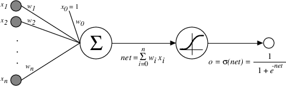

---
jupyter:
  jupytext:
    formats: ipynb,md
    text_representation:
      extension: .md
      format_name: markdown
      format_version: '1.3'
      jupytext_version: 1.13.0
  kernelspec:
    display_name: Python 3
    language: python
    name: python3
---

<!-- #region slideshow={"slide_type": "slide"} -->
# 简介
<!-- #endregion -->
<!-- #region slideshow={"slide_type": "subslide"} -->

## 人工神经网络（Artificial Neural Networks------ANNs）

-   人工神经网络（Artificial Neural
    Networks------ANNs）提供了一种普遍而且实用的方法，来从样例中学习值为实数、离散或向量的函数。
-   反向传播（BackPropagation）算法使用梯度下降来调节网络参数以最佳拟合由输入-输出对组成的训练集合。
-   ANN学习对于训练数据中的错误鲁棒性很好，且已经成功地应用到很多领域，例如
    -   视觉场景分析（interpreting visual scenes）
    -   语音识别
    -   机器人控制
    -   ......

<!-- #endregion -->
<!-- #region slideshow={"slide_type": "subslide"} -->
## 示例

-   Pomerleau（1993）的 ALVINN (Autonomous Land Vehicle In a Neural
    Network)系统是ANN学习的一个典型实例，

    ``` example
    http://ftp.utcluj.ro/pub/docs/imaging/
    Autonomous_driving/Articole%20sortate/
    CThorpe/ALVINN%20Project%20Home%20Page.htm
    ```

-   这个系统使用一个学习到的ANN以正常的速度在高速公路上驾驶汽车。

    -   ANN的输入是一个30x32像素的网格，像素的亮度来自一个安装在车辆上的前向摄像机。
    -   ANN的输出是车辆行进的方向。
    -   这个ANN通过观察人类驾驶时的操纵命令进行训练，训练过程大约5分钟。

-   ALVINN用学习到的网络在高速公路上以70英里时速成功地驾驶了90英里（在分行公路的左车道行驶，同时有其他车辆）。

<!-- #endregion -->
<!-- #region slideshow={"slide_type": "subslide"} -->
## 示例(ALVINN系统)

`\center`{=latex}


<!-- #endregion -->
<!-- #region slideshow={"slide_type": "subslide"} -->
## 示例(ALVINN原理)

`\center`{=latex}


<!-- #endregion -->
<!-- #region slideshow={"slide_type": "subslide"} -->
## 示例(隐藏单元权值)

`\center`{=latex}


<!-- #endregion -->
<!-- #region slideshow={"slide_type": "subslide"} -->
## 人工神经网络适用问题

-   实例是用很多"属性-值"对表示的。
    -   要学习的目标函数是定义在可以用向量描述的实例之上的，向量由预先定义的特征组成，
        -   例如ALVINN例子中的像素值。
    -   这些输入属性之间可以高度相关，也可以相互独立。
    -   输入值可以是任何实数。
-   目标函数的输出可能是离散值、实数值或者由若干实数属性或离散属性组成的向量。
    -   例如，
        -   在ALVINN系统中输出的是30个属性的向量，每一个分量对应一个建议的驾驶方向。
        -   每个输出值是0和1之间的某个实数，对应于在预测相应驾驶方向时的置信度（confidence）。
        -   我们也可以训练一个单一网络，同时输出行驶方向和建议的加速度，这只要简单地把编码这两种输出预测的向量连接在一起就可以了。

<!-- #endregion -->
<!-- #region slideshow={"slide_type": "subslide"} -->
## 人工神经网络适用问题(续)

-   训练数据可能包含错误。
    -   ANN学习算法对于训练数据中的错误有非常好的鲁棒性。
-   可容忍长时间的训练。
    -   网络训练算法通常比像决策树学习这样的算法需要更长的训练时间。
        -   训练时间可能从几秒钟到几小时，这要看网络中权值的数量、要考虑的训练实例的数量、以及不同学习算法参数的设置等因素。
-   可能需要快速求出目标函数值。
    -   尽管ANN的学习时间相对较长，但对学习到的网络求值，以便把网络应用到后续的实例，通常是非常快速的。
        -   例如，ALVINN在车辆向前行驶时，每秒应用它的神经网络若干次，以不断地更新驾驶方向。
-   人类能否理解学到的目标函数是不重要的。
    -   神经网络方法学习到的权值经常是人类难以解释的。
    -   学到的神经网络比学到的规则难于传达给人类。

<!-- #endregion -->
<!-- #region slideshow={"slide_type": "slide"} -->
# 感知器

<!-- #endregion -->
<!-- #region slideshow={"slide_type": "subslide"} -->
## 感知器


$$o(x_{1}, \ldots, x_{n}) = \left\{ \begin{array}{rl}
     1 & \mbox{if $w_{0} + w_{1}x_1 + \cdots + w_n x_n > 0$}\\
     -1 & \mbox{otherwise.}  
\end{array}
\right. $$

简化表示:

$$
o(\vec{x}) = \left\{ \begin{array}{rl}
     1 & \mbox{if $\vec{w} \cdot \vec{x} > 0$}\\
     -1 & \mbox{otherwise.}  
\end{array}
\right. 
$$

<!-- #endregion -->
<!-- #region slideshow={"slide_type": "subslide"} -->
## 两输入感知器的决策平面


<!-- #endregion -->
<!-- #region slideshow={"slide_type": "subslide"} -->
## 感知器训练法则(perceptron learning rule)

$$w_i \leftarrow w_i + \Delta w_i $$ where
$$ \Delta w_{i} = \eta (t - o) x_{i} $$

其中:

-   $t=c(\vec{x})$ 是当前训练样例的目标输出
-   $o$ 是感知器的输出
-   $\eta$ 是一个正的常数称为学习速率（learning rate）

<!-- #endregion -->
<!-- #region slideshow={"slide_type": "subslide"} -->
## 收敛性

-   在有限次使用感知器训练法则后，训练过程会收敛到一个能正确分类所有训练样例的权向量，

前提：

-   训练样例线性可分，
-   使用了充分小的 $\eta$ （参见Minskey & Papert 1969）
<!-- #endregion -->
<!-- #region slideshow={"slide_type": "subslide"} -->

## 梯度下降和delta法则

考虑线性单元：

$$ o = w_{0} + w_{1}x_1 + \cdots + w_n x_n $$

学习使均方误差

$$ E[\vec{w}] \equiv  \frac{1}{2}\sum_{d \in D}(t_{d} - o_{d})^{2} $$

最小的 $w_{i}$ 。其中 $D$ 训练样例集合。

<!-- #endregion -->
<!-- #region slideshow={"slide_type": "subslide"} -->
## 误差曲面


<!-- #endregion -->
<!-- #region slideshow={"slide_type": "subslide"} -->
## 梯度下降算法

$$ \nabla E[\vec{w}] \equiv \left[\frac{\partial E}{\partial w_{0}},
\frac{\partial E}{\partial w_{1}}, \cdots \frac{\partial E}{\partial
w_{n}}\right] $$

训练法则:

$$\Delta \vec{w} = -\eta \nabla E[\vec{w}] $$

或：

$$\Delta w_{i} = -\eta  \frac{\partial E}{\partial w_{i}}$$

<!-- #endregion -->
<!-- #region slideshow={"slide_type": "subslide"} -->
## 推导：

$$
\frac{\partial E}{\partial w_{i}}  =  \frac{\partial}{\partial w_{i}} \frac{1}{2}\sum_{d}(t_{d} - o_{d})^{2} 
$$

$$
  =  \frac{1}{2}\sum_{d}\frac{\partial}{\partial w_{i}}(t_{d} - o_{d})^{2} 
$$

$$
=  \frac{1}{2}\sum_{d} 2 (t_{d} - o_{d}) \frac{\partial}{\partial w_{i}}(t_{d} - o_{d}) 
$$

$$
  =  \sum_{d} (t_{d} - o_{d}) \frac{\partial}{\partial w_{i}}(t_{d} - \vec{w} \cdot \vec{x_{d}})
$$

$$
\frac{\partial E}{\partial w_{i}} =  \sum_{d} (t_{d} - o_{d}) (- x_{i,d}) \nonumber
$$
<!-- #endregion -->
<!-- #region slideshow={"slide_type": "subslide"} -->
## 训练线性单元的梯度下降算法

Gradient-Descent( training\\\_examples , $eta$)

-   $training\_examples$ 中每个训练样例形式为序偶
    $\langle \vec{x}, t \rangle$ ， 其中
    -   $\vec{x}$ 是输入值向量，
    -   $t$ 是目标输出值。
    -   $\eta$ 是学习速率（例如0.05）。
-   初始化每个 $w_{i}$ 为某个小的随机值
-   遇到终止条件之前:
    -   初始化每个 $\Delta w_{i}$ 为0
    -   对于训练样例 $training\_examples$ 中的每个
        $\langle \vec{x},t \rangle$ ，做：
        -   把实例 $\vec{x}$ 输入到此单元，计算输出 $o$
        -   对于线性单元的每个权 $w_{i}$ :
            $$\Delta w_{i} \leftarrow \Delta w_{i} + \eta (t - o) x_{i}$$
    -   对于线性单元的每个权 $w_{i}$ ，做
        $$w_{i} \leftarrow w_{i} + \Delta w_{i}$$

<!-- #endregion -->
<!-- #region slideshow={"slide_type": "subslide"} -->
## 增量（随机）梯度下降算法

-   批量梯度下降:
    -   计算梯度 $\nabla E_{D}[\vec{w}]$
    -   $\vec{w} \leftarrow \vec{w} -\eta \nabla E_{D}[\vec{w}]$
-   增量梯度下降:
    -   对训练集 $D$ 中的样例 $d$
        -   计算梯度 $\nabla E_{d}[\vec{w}]$
        -   $\vec{w} \leftarrow \vec{w} -\eta \nabla E_{d}[\vec{w}]$

其中
$$E_{D}[\vec{w}] \equiv  \frac{1}{2}\sum_{d \in D}(t_{d} - o_{d})^{2}$$
$$E_{d}[\vec{w}] \equiv  \frac{1}{2}(t_{d} - o_{d})^{2}$$

<!-- #endregion -->
<!-- #region slideshow={"slide_type": "slide"} -->
# 多层网络和反向传播算法

<!-- #endregion -->
<!-- #region slideshow={"slide_type": "subslide"} -->
## 多层网络


<!-- #endregion -->
<!-- #region slideshow={"slide_type": "subslide"} -->
## Sigmoid 单元



$$\sigma(x)= \frac{1}{1 + e^{-x}} $$

$$\frac{d \sigma(x)}{dx} = \sigma(x) (1 - \sigma(x))$$

可得梯度下降法则用于训练：

-   单个 sigmoid 单元
-   由 sigmoid 单元构成的多层网络 $\rightarrow$
    反向传播（Backpropagation）

<!-- #endregion -->
<!-- #region slideshow={"slide_type": "subslide"} -->
## Sigmoid 单元的误差梯度
$$
\frac{\partial E}{\partial w_{i}}  =  \frac{\partial}{\partial w_{i}}\frac{1}{2}\sum_{d\in D}(t_{d} - o_{d})^{2} 
$$

$$
 =  \frac{1}{2}\sum_{d}\frac{\partial}{\partial w_{i}}(t_{d} - o_{d})^{2}
$$
$$
 =  \frac{1}{2}\sum_{d} 2 (t_{d} - o_{d})\frac{\partial}{\partial w_{i}}(t_{d} - o_{d})
$$
$$
 =  \sum_{d} (t_{d} - o_{d}) \left( - \frac{\partial o_{d}}{\partial w_{i}}\right)
$$
$$
 =  - \sum_{d} (t_{d} - o_{d})\ \frac{\partial o_{d}}{\partial net_{d}}\ \frac{\partial net_{d}}{\partial w_{i}}
$$
<!-- #endregion -->
<!-- #region slideshow={"slide_type": "subslide"} -->
## Sigmoid 单元的误差梯度

已知: $$\frac{\partial o_{d}}{\partial net_{d}} = \frac{\partial
\sigma(net_{d})}{\partial net_{d}} =  o_{d}(1 -  o_{d})  $$

$$\frac{\partial net_{d}}{\partial w_{i}} = \frac{\partial (\vec{w} \cdot
\vec{x}_{d})}{\partial w_{i}} = x_{i,d} $$

得:

$$
\frac{\partial E}{\partial w_{i}}  =  - \sum_{d \in D} (t_{d} - o_{d}) o_{d}(1-o_{d}) x_{i,d} 
$$
<!-- #endregion -->
<!-- #region slideshow={"slide_type": "subslide"} -->
## 反向传播算法

Backpropagation( training_examples , $\eta$ , $n_{in}$ , $n_{out}$ ,
$n_{hidden}$ )

-   trainning_examples 中每一个训练样例是形式为 $<\vec{x},\vec{t}>$
    的序偶，其中 $\vec{x}$ 是网络输入值向量， $\vec{t}$ 是目标输出值。
-   $\eta$ 是学习速率（例如0.05）。
-   $n_{in}$ 是网络输入的数量，
-   $n_{hidden}$ 是隐藏层单元数，
-   $n_{out}$ 是输出单元数。
-   从单元i到单元j的输入表示为 $x_{ji}$ ，单元i到单元j的权值表示为
    $w_{ij}$ 。

<!-- #endregion -->
<!-- #region slideshow={"slide_type": "subslide"} -->
## 反向传播算法

Backpropagation( training_examples , $\eta$ , $n_{in}$ , $n_{out}$ ,
$n_{hidden}$ )

-   创建网络: $n_{in}$ 个输入，$n_{hidden}$ 个隐藏单元， $n_{out}$
    个输出

-   初始化所有网络权值为小的随机值（如 $[-0.05,0.05]$ ）

-   在遇到终止条件前:

    对于训练样例 training_examples 中的每个 $<\vec{x},\vec{t}>$ :

    -   把输入沿网络前向传播
        -   把实例输入网络，并计算网络中每个单元 $u$ 的输出 $o_u$ 。
    -   使误差沿网络反向传播
        -   对于网络的每个输出单元k，计算它的误差项 $\delta_{k}$
            $$\delta_{k} \leftarrow o_{k}(1-o_{k})(t_{k}-o_{k})$$
        -   对于网络的每个隐藏单元 $h$ ，计算它的误差项 $\delta_h$
            $$\delta_{h} \leftarrow o_{h}(1-o_{h})\sum_{k \in outputs}w_{h,k}\delta_{k}$$
        -   更新每个网络权值 $w_{i,j}$
            $$w_{i,j} \leftarrow w_{i,j} + \Delta w_{i,j}$$ 其中
            $$\Delta w_{i,j} = \eta \delta_{j} x_{i,j}$$

<!-- #endregion -->
<!-- #region slideshow={"slide_type": "subslide"} -->
## Learning Hidden Layer Representations


# ANN

   

# Data
```
  Input      ->   Output
  ----------------------------
  10000000   ->   10000000
  01000000   ->   01000000
  00100000   ->   00100000
  00010000   ->   00010000
  00001000   ->   00001000
  00000100   ->   00000100
  00000010   ->   00000010
  00000001   ->   00000001

```
<!-- #endregion -->
<!-- #region slideshow={"slide_type": "subslide"} -->
## Learning Hidden Layer Representations(result)

```
  ---------- --------------- ----- ----- ----- --
  10000000   ->   .89   .04   .08   ->   10000000
  01000000   ->   .01   .11   .88   ->   01000000
  00100000   ->   .01   .97   .27   ->   00100000
  00010000   ->   .99   .97   .71   ->   00010000
  00001000   ->   .03   .05   .02   ->   00001000
  00000100   ->   .22   .99   .99   ->   00000100
  00000010   ->   .80   .01   .98   ->   00000010
  00000001   ->   .60   .94   .01   ->   00000001
  ---------- --------------- ----- ----- ----- --
```
<!-- #endregion -->
<!-- #region slideshow={"slide_type": "subslide"} -->
``## 其它误差函数

-   为权值增加惩罚项：
    $$E(\vec{w}) \equiv \frac{1}{2}\sum_{d \in D} \sum_{k \in outputs} (t_{kd} -o_{kd})^2 + \gamma \sum_{i,j}w_{ji}^{2}$$
-   对误差增加一项目标函数的斜率（slope）或导数：
    $$E(\vec{w}) \equiv \frac{1}{2} \sum_{d \in D} \sum_{k \in outputs} \left[ (t_{kd} -
       o_{kd})^2 + \mu \sum_{j \in inputs}
       \left(\frac{\partial t_{kd}}{\partial x^j_d} - \frac{\partial
       o_{kd}}{\partial x^j_d}\right)^2 \right]$$
-   使网络对目标值的交叉熵（cross entropy）最小化
-   权值共享（weight sharing）
<!-- #endregion -->
