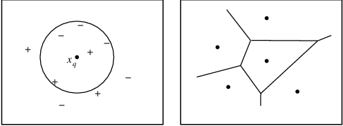
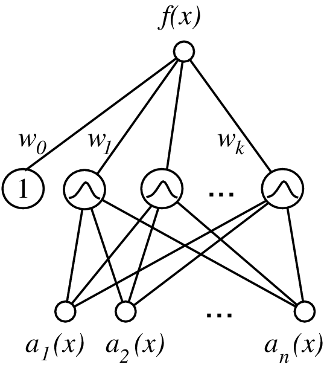
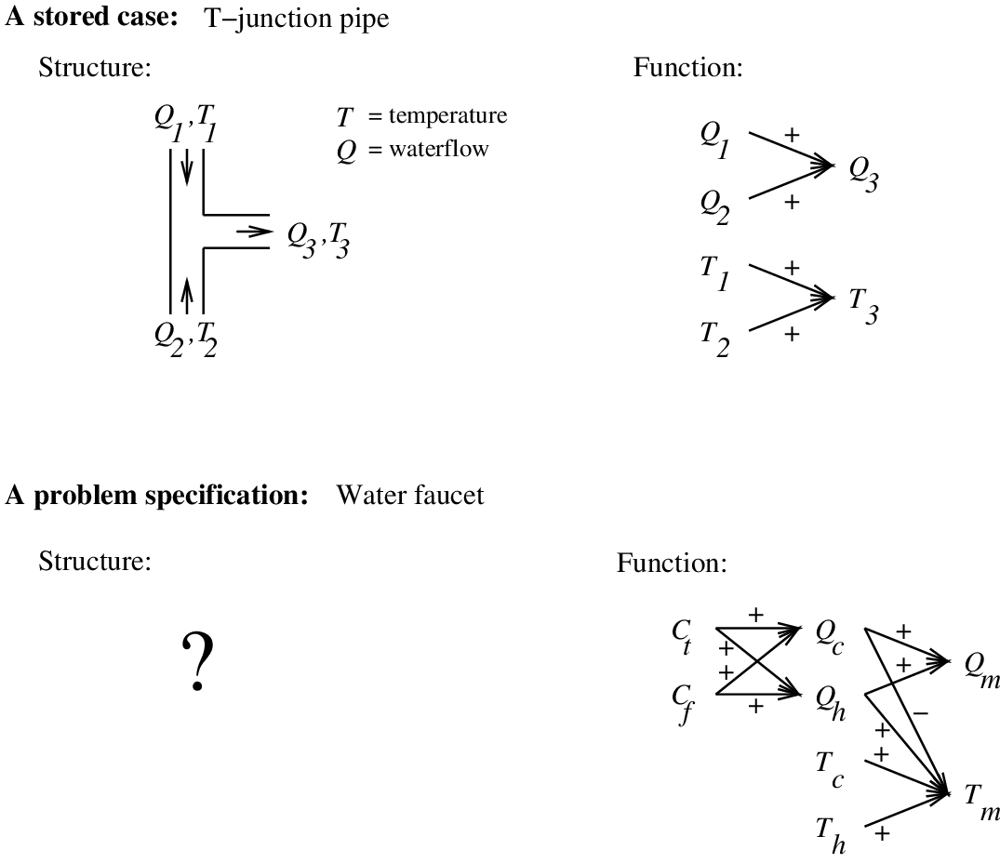

---
jupyter:
  jupytext:
    formats: ipynb,md
    text_representation:
      extension: .md
      format_name: markdown
      format_version: '1.3'
      jupytext_version: 1.13.1
  kernelspec:
    display_name: Python 3
    language: python
    name: python3
---

<!-- #region slideshow={"slide_type": "slide"} -->
# 基于实例的学习
<!-- #endregion -->

<!-- #region slideshow={"slide_type": "slide"} -->
简介
====
<!-- #endregion -->
<!-- #region slideshow={"slide_type": "slide"} -->

基于实例的学习（Instance Based Learning ）
------------------------------------------

-   $k$ -近邻 ( $k$ -Nearest Neighbor)
-   局部加权回归 （Locally weighted regression）
-   径向基函数（Radial basis functions）
-   Case-based reasoning
-   Lazy and eager learning

<!-- #endregion -->
<!-- #region slideshow={"slide_type": "slide"} -->
KNN
===

<!-- #endregion -->
<!-- #region slideshow={"slide_type": "subslide"} -->
K最近邻算法
-----------

关键思想： 只保存所有训练样例 $\langle x_i, f(x_i) \rangle$

-   最近邻
    -   给定查询实例 $x_q$, 首选确定最近的训练实例 $x_n$,
    -   然后估计 $\hat{f}(x_q) \leftarrow f(x_n)$
-   $k$ - 最近邻
    -   给定查询实例 Given $x_q$ , 最近的 $k$ 个训练实例投票
        (目标函数为离散值)
    -   最近的 $k$ 个训练样例的 $f$ 值取平均(实值目标函数)
        $$\hat{f}(x_{q}) \leftarrow  \frac{\sum_{i=1}^{k}f(x_{i})}{k}$$

<!-- #endregion -->
<!-- #region slideshow={"slide_type": "subslide"} -->
何时使用最近邻算法
------------------

-   实例映身到空间 $\Re^n$ 中的点

-   每实例少于 20 个属性

-   大量训练数据

-   优点:

    -   训练快
    -   可学习复杂函数
    -   不损失信息

-   缺点:

    -   查询慢
    -   易受不相关属性干扰

<!-- #endregion -->
<!-- #region slideshow={"slide_type": "subslide"} -->
Voronoi Diagram
---------------



<!-- #endregion -->
<!-- #region slideshow={"slide_type": "subslide"} -->
Behavior in the Limit
---------------------

设 $p(x)$ 定义为实例 $x$ 应被标记为 1 (positive) 而不是 0 (negative)
的概率。

最近邻:

-   当训练样例数量 $\rightarrow \infty$, 逼近 Gibbs 算法
-   Gibbs: 按概率 $p(x)$ 预测 1, 否则 0

$k$ -最近邻:

-   当训练样例数量 $\rightarrow \infty$ 且 $k$ 值较大,
    逼近贝叶斯最优分类器
-   Bayes optimal: 当 $p(x)>.5$ 预测 1, 否则 0

注意： 期望错误率 Gibbs 至多是 Bayes optimal 的两倍。

<!-- #endregion -->
<!-- #region slideshow={"slide_type": "subslide"} -->
距离加权KNN算法（Distance-Weighted $k$ NN）
-------------------------------------------

-   也许想让距离近的权重大些
    $$\hat{f}(x_{q}) \leftarrow  \frac{\sum_{i=1}^{k} w_{i} f(x_{i})}{\sum_{i=1}^{k} w_{i}}$$
    其中
    -   $$w_{i} \equiv \frac{1}{d(x_{q}, x_{i})^{2}}$$
    -   $d(x_{q}, x_{i})$ 是 $x_{q}$ 与 $x_{i}$ 之间的距离
-   注意：现在它可以使用所有训练样例而不仅是 $k$ 个。(Shepard\'s method)

<!-- #endregion -->
<!-- #region slideshow={"slide_type": "subslide"} -->
Curse of Dimensionality
-----------------------

-   考虑把k-近邻算法应用到这样一个问题：
    -   每个实例由20个属性描述，但在这些属性中仅有2个与它的分类是有关。
    -   在这种情况下，这两个相关属性的值一致的实例可能在这个20维的实例空间中相距很远。
    -   结果，依赖这20个属性的相似性度量会误导k-近邻算法的分类。

<!-- #endregion -->
<!-- #region slideshow={"slide_type": "subslide"} -->
Curse of Dimensionality
-----------------------

-   *Curse of dimensionality : 高维空间 $X$ 中最近邻易被误导*
-   一种解决方法
    -   按权重 $z_j$ 伸展第 $j$ 个坐标轴 , 其中 $z_1, \ldots, z_n$
        按最小预测误差选取
    -   使用交叉验证（ cross-validation）自动选取权重 $z_1, \ldots, z_n$
    -   设置 $z_j$ 为0可消除第 $j$ 维影响

<!-- #endregion -->
<!-- #region slideshow={"slide_type": "slide"} -->
局部加权回归
============

<!-- #endregion -->
<!-- #region slideshow={"slide_type": "subslide"} -->
局部加权回归（Locally Weighted Regression）
-------------------------------------------

-   kNN 为每个查询点 $x_q$ 构造了 $f$ 的局部逼近
-   局部加权回归为包含 $x_q$ 的区域显示地构造逼近函数 $\hat{f}(x)$
    -   对 $k$ 个近邻 拟合线性函数
    -   拟合二次函数
    -   分段逼近 $f$

<!-- #endregion -->
<!-- #region slideshow={"slide_type": "subslide"} -->
误差准则:
---------

-   $k$ 近邻的误差平方和最小化
    $$E_{1}(x_q) \equiv \frac{1}{2} \sum_{x \in\ k\ nearest\ nbrs\ of\ x_q} (f(x)- \hat{f}(x))^2$$
-   使整个训练样例集合D上的误差平方和最小化，但对每个训练样例加权，权值为关于相距xq距离的某个递减函数K：
    $$E_{2}(x_q) \equiv \frac{1}{2} \sum_{x \in D} (f(x) - \hat{f}(x))^2 K(d(x_{q}, x))$$

<!-- #endregion -->
<!-- #region slideshow={"slide_type": "slide"} -->
RBF Networks
============

<!-- #endregion -->
<!-- #region slideshow={"slide_type": "subslide"} -->
Radial Basis Function Networks
------------------------------

-   全局逼近目标函数 , 是局部逼近的线性组合
-   另一种神经网络
-   与距离加权回归有密切联系，但属于积极（eager）方法，而不是消极（lazy）方法。

<!-- #endregion -->
<!-- #region slideshow={"slide_type": "subslide"} -->
Radial Basis Function Networks
------------------------------

### 网络 



### 说明 

其中 $a_i(x)$ 是描述实例 $x$ 的属性 , 且有
$$f(x) =  w_0 + \sum_{u=1}^{k} w_u K_u(d(x_u,x))$$

$K_u(d(x_u,x))$ 通常可选为：
$$K_u(d(x_u,x)) = e^{- \frac{1}{2 \sigma_u^2}d^2(x_u,x)}$$

<!-- #endregion -->
<!-- #region slideshow={"slide_type": "subslide"} -->
Training Radial Basis Function Networks
---------------------------------------

-   Q1: 核函数 $K_u(d(x_u,x))$ 的 $x_u$ 如何选取？
    -   均匀分布在实例空间中
    -   或使用训练实例(反映了实例分布)
-   Q2: 如何训练权重 (假设是 Gaussian $K_u$)
    -   首先为每个$K_u$ 选择方差 (与均值)
        -   例如，使用 EM 算法
    -   然后固定 $K_u$ , 训练线性网络层
        -   拟合线性函数

<!-- #endregion -->
<!-- #region slideshow={"slide_type": "slide"} -->
Case-Based Reasoning
====================

<!-- #endregion -->
<!-- #region slideshow={"slide_type": "subslide"} -->
Case-Based Reasoning
--------------------

当 $X \neq \Re^n$ 时 应用基于实例的学习 （需要不同的"距离"度量）

基于案例的推理------基于实例的推理应用于符号逻辑描述

```
((user-complaint error53-on-shutdown)
 (cpu-model PowerPC)
 (operating-system Windows)
 (network-connection PCIA)
 (memory 48meg)
 (installed-applications Excel Netscape VirusScan)
 (disk 1gig)
 (likely-cause ???))
```
<!-- #endregion -->
<!-- #region slideshow={"slide_type": "subslide"} -->
Case-Based Reasoning in CADET
-----------------------------

-   CADET: 存储了 75 个机械设置样例
    -   每个训练样例: $\langle$ qualitative function,
        mechanical-structure $\rangle$
    -   新查询: desired function,
    -   目标: mechanical structure for this function
-   距离度量: match qualitative function descriptions

<!-- #endregion -->
<!-- #region slideshow={"slide_type": "subslide"} -->
Case-Based Reasoning in CADET
-----------------------------



<!-- #endregion -->
<!-- #region slideshow={"slide_type": "subslide"} -->
与KNN区别
---------

基于案例的推理系统区别于k-近邻这样的方法的若干一般特征：

-   实例或案例可以用丰富的符号描述表示，就像CADET中使用的功能图。
    这可能需要不同于欧氏距离的相似性度量，比如两个功能图的最大可共享子图的大小。
-   检索到的多个案例可以合并形成新问题的解决方案。
    这与k-近邻方法相似------多个相似的案例用来构成对新查询的回答。
    然而，合并多个检索到的案例的过程与k-近邻有很大不同，它依赖于知识推理而不是统计方法。
-   案例检索、基于知识的推理和问题求解间是紧密耦合在一起的。
    例如CADET系统在尝试找到匹配的案例过程中，它使用有关物理感应的一般知识重写了功能图。

<!-- #endregion -->
<!-- #region slideshow={"slide_type": "slide"} -->
Lazy and Eager Learning
=======================

<!-- #endregion -->
<!-- #region slideshow={"slide_type": "subslide"} -->
Lazy and Eager Learning
-----------------------

-   Lazy: 消极方法等到查询实例 $x_q$ 时从训练数据 $D$ 中泛化
    -   $k$ -Nearest Neighbor, Case based reasoning
-   Eager: 积极方法在见到查询实例 $x_q$
    前，已经选进行了泛化（选取了对目标函数的（全局）逼近）。
    -   Radial basis function networks, ID3, Backpropagation,
        NaiveBayes, $\ldots$

<!-- #endregion -->
<!-- #region slideshow={"slide_type": "subslide"} -->
积极学习的和消极学习之间的差异
------------------------------

-   积极学习的和消极学习之间的差异意味着对目标函数的全局逼近和局部逼近的差异。
    -   消极的学习器可以通过很多局部逼近的组合（隐含地）表示目标函数，
    -   积极的学习器必须在训练时提交单个的全局逼近。
    -   对于同样的 $H$, 消极的学习器可表达更复杂的函数 (如 $H$ =
        线性函数)
<!-- #endregion -->
